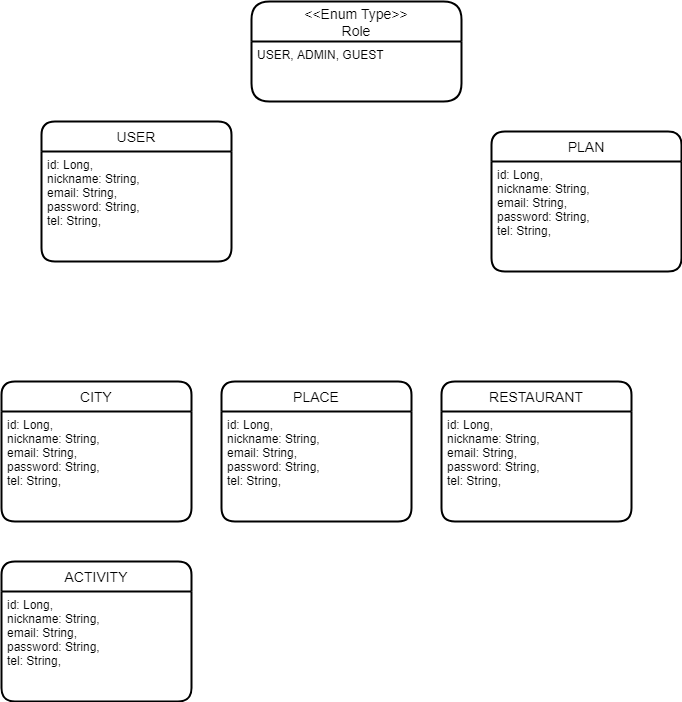

# TRIPLus

😄  **즐거운 여행을 위한 TRIPLus**  😄

Triplus는 Trip과 plus 라는 단어를 합쳐 '여행을 더하다' 라는 의미와 Trip + Us [트리플어스] 의 '우리, 같이의 여행' 이라는 의미를 담고 있습니다.  

[TRIPLus 보러가기](http://www.triplus.kro.kr:8080)

## 1. Getting Started

### 1-1. Environment

> -   JAVA 11
>-   MariaDB 10
> -   Gradle
>-   Ubuntu 20.04
> 

### 1-2. Installing / Cloning
`$ git clone https://github.com/dooyeong20/special-trip.git`

## 2. Build & Run App

### - Windows

    special-trip\triplus$ gradlew build (-x test)
    special-trip\triplus$ java -jar ./build/libs/{app}.war

### - MacOS / Linux
    special-trip\triplus$ ./gradlew build (-x test)
    special-trip\triplus$ java -jar ./build/libs/{app}.war

### 3. ERD

